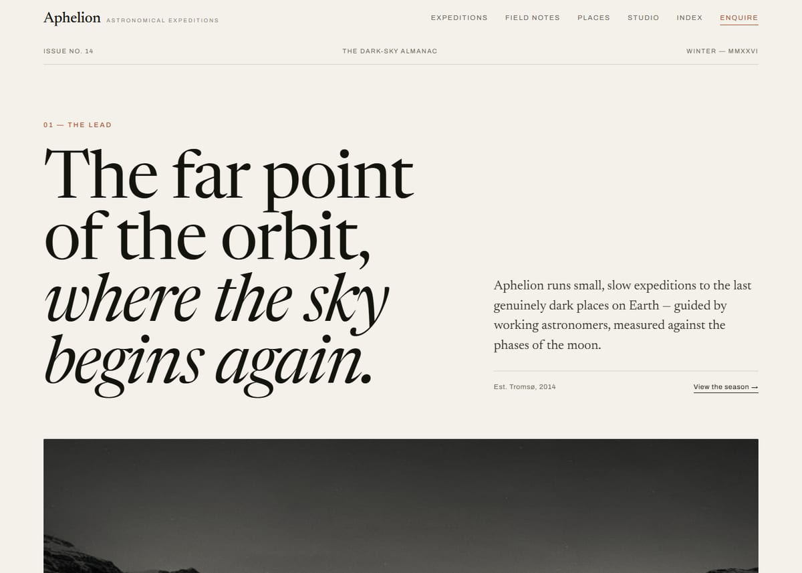
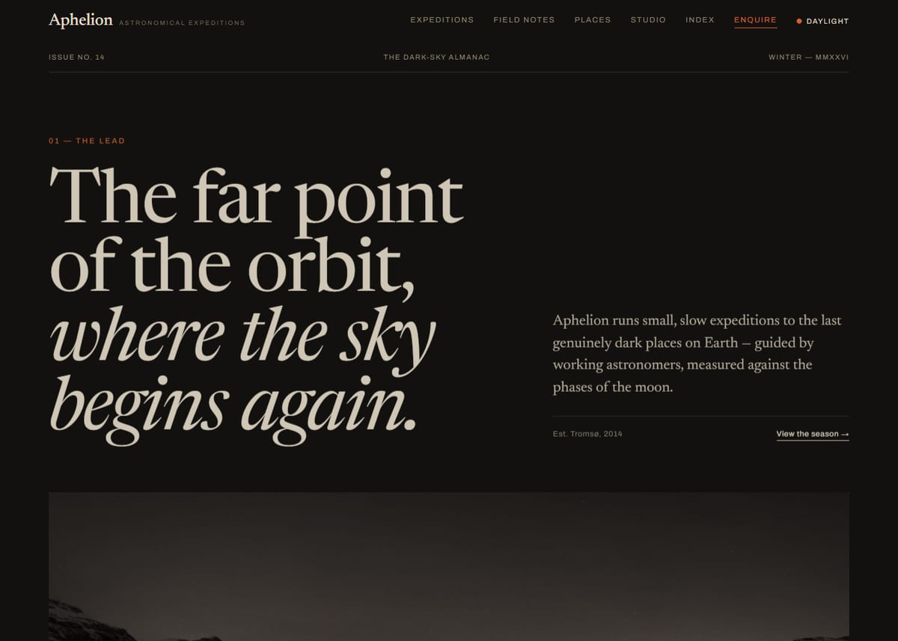

# Aphelion

**Astronomical expeditions to the darkest skies on Earth.**
A multi-page editorial site for a fictional astro-tourism studio — built to read like a printed
almanac, not a travel funnel.

**Live: [aphelion-muradzde.vercel.app](https://aphelion-muradzde.vercel.app)** · try the
[red-light mode](https://aphelion-muradzde.vercel.app), the
[season catalogue](https://aphelion-muradzde.vercel.app/expeditions) and
[the system](https://aphelion-muradzde.vercel.app/system).



Warm paper, ink, one rust accent. Serif display type, hairline rules, numbered sections, and a
lot of air. No gradients, no glow, no card shadows — depth comes from rules and space.

## Highlights

- **Six expeditions** with night-by-night programmes, honest constraints included — the Atacama
  itinerary tells you plainly that ALMA's high site is closed to visitors, and Mauna Kea's
  "not included" list ends with _summit access after dark — nobody can sell you that_.
- **Five essays** in the expedition logbook, written in one editorial voice.
- **The dark windows** — the cover computes the next four new moons client-side (truncated Meeus
  algorithm, accurate to minutes) and prints the nine-night observing window around each.
- **Red-light mode** — field astronomers use red lamps to protect their dark adaptation; the
  header toggle does the same for the reader. Persisted, applied before first paint.

  

- **The season catalogue as PDF** — the print stylesheet sets every expedition like an almanac
  spread; `scripts/generate-catalogue.mjs` binds them into a downloadable catalogue.
- **A real index** — `/index` closes with every place, expedition, essay and term, alphabetised
  the way a printed annual would do it.
- **The System** — `/system` documents the design language on its own pages: swatches, type
  specimen, spacing, components.

## Engineering

|            |                                                                             |
| ---------- | --------------------------------------------------------------------------- |
| Stack      | React 18 · Vite · React Router 6 · plain CSS with design tokens             |
| API        | Express locally, a serverless twin of the same endpoint for production      |
| Type       | Newsreader & Archivo, self-hosted variable woff2, preloaded                 |
| Images     | AVIF + JPEG variants with `srcset`/`sizes`, duotone applied in CSS          |
| Motion     | One shared `IntersectionObserver`; honours `prefers-reduced-motion`         |
| Quality    | ESLint (flat) · Prettier · Playwright e2e in CI                             |
| Lighthouse | 100 · 100 · 100 · 100 (desktop, production build) — LCP 0.7 s, CLS ≈ 0      |
| Extras     | JSON-LD per page · sitemap · PWA manifest · security headers · print styles |

No UI framework, no CSS framework, no animation library. The reveal effect is ~40 lines of
`IntersectionObserver`; without JavaScript the content is simply visible.

## Quick start

```bash
npm install
npm run dev
```

Two processes start together: the Express API on **:3001** and Vite on **:5173** (with `/api/*`
proxied). Open <http://localhost:5173>.

## Scripts

| Script                                | What it does                                         |
| ------------------------------------- | ---------------------------------------------------- |
| `npm run dev`                         | API + web, together                                  |
| `npm run build` / `preview`           | Production build / serve it locally                  |
| `npm run lint` / `format`             | ESLint / Prettier                                    |
| `npm run test:e2e`                    | Playwright suite — navigation, forms, themes, mobile |
| `npm run images`                      | Regenerate photography + AVIF/JPEG variants          |
| `npm run sitemap`                     | Regenerate `public/sitemap.xml`                      |
| `node scripts/generate-catalogue.mjs` | Rebind the PDF catalogue (site must be running)      |
| `node scripts/generate-og.mjs`        | Regenerate per-page share images                     |

## Structure

```text
├── api/                 # serverless enquiry endpoint (Vercel)
├── server/              # Express: content endpoints + POST /api/enquiry
├── public/              # fonts, images, og previews, icons, catalogue PDF
├── scripts/             # asset pipelines: images, og, icons, fonts, sitemap, pdf
├── src/
│   ├── components/      # Nav, Colophon, ExpeditionItem, Accordion, EnquiryForm…
│   ├── pages/           # one file per route
│   ├── data/            # expeditions, notes, places, faq, studio — single source of truth
│   ├── styles/          # tokens.css · base.css · type.css · fonts.css
│   ├── hooks/ lib/      # usePageMeta, moon maths, reveal, theme, api client
│   └── router.jsx
└── tests/e2e/           # Playwright suite, runs in CI
```

### Routes

| Path                                  | Page                                                |
| ------------------------------------- | --------------------------------------------------- |
| `/`                                   | The cover — lead, season, dark windows, note teaser |
| `/expeditions` · `/expeditions/:id`   | The season, filterable · programme, rail, enquiry   |
| `/field-notes` · `/field-notes/:slug` | The logbook · reading template with progress line   |
| `/places`                             | Dark-sky places, catalogued by Bortle class         |
| `/studio`                             | Mission, principles, the guides                     |
| `/enquire`                            | The form — validated both sides, three states       |
| `/index`                              | Questions answered plainly + the index proper       |
| `/system`                             | Appendix: the house style, set in full              |

### Content and data

All copy lives in `src/data/*.json` and is imported statically — a content site should not fetch
its own text through a request waterfall. The Express server exposes the same files over
`/api/*` so the data layer can be pointed at a real backend without touching components. The one
endpoint the UI depends on is `POST /api/enquiry`: shared validation
(`server/lib/enquiry.js`), `201`/`422` responses, and a serverless twin in `api/` so the form
works in production.

The photography is generated placeholder art, committed as static assets and pushed to the house
duotone by CSS (`grayscale` + `sepia` + a rust wash under a grain texture) — so any future real
photograph will fall into the same palette the moment it lands in `public/images/`.

## Design principles

1. **The printed page, not the web.** Asymmetric grids, numbered sections, captions that matter.
2. **Near monochrome, one accent.** Paper `#F4F1EA`, ink `#14140F`, rust `#B3502B` — used rarely.
3. **Two faces only.** Newsreader for display and reading, Archivo for UI. Fluid via `clamp()`.
4. **Links are text with a line**, never pills. Radius is 2 px or nothing. Shadows: none.
5. **8 px spacing base**; hairlines at ink-15 %, a full-ink rule where a section truly starts.
6. **Copy without exclamation marks.** Concrete details, real constraints, a point of view.

## Accessibility

Semantic landmarks and a skip link; visible `:focus-visible`; `aria-expanded` on menu and
accordion; labelled fields with inline errors; AA contrast in both themes; all motion disabled
under `prefers-reduced-motion`.

## Deploying

The production site runs on Vercel: [aphelion-muradzde.vercel.app](https://aphelion-muradzde.vercel.app).

- **Vercel** — zero config: SPA rewrites, security headers and the serverless enquiry endpoint
  are already wired in `vercel.json` and `api/`. Build `npm run build`, output `dist`.
- **Netlify** — `public/_redirects` and `public/_headers` cover the same ground; point the form
  at any endpoint accepting the same payload.

## License

[MIT](LICENSE). Newsreader and Archivo are used under the SIL Open Font License.
The places are real; the studio, prices and departures are not — yet.
